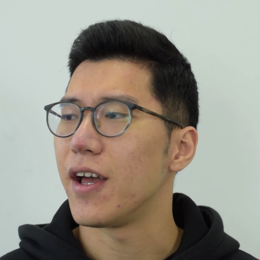
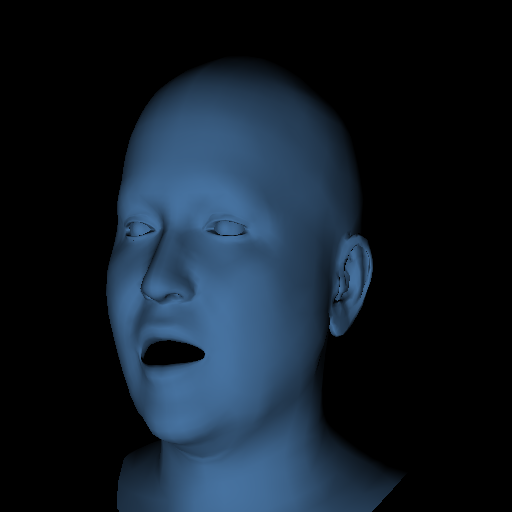

<!--
 * @Author: yanxinhao
 * @Email: 1914607611xh@i.shu.edu.cn
 * @LastEditTime: 2021-12-26 20:02:54
 * @LastEditors: yanxinhao
 * @Description: 
-->

# 3D Face Morphable Model
## Introduction
 This project is used to reconstruct the 3d human face by fitting the landmarks of faces. By now, the fitting process which is based on [flame](https://flame.is.tue.mpg.de/) has been implemented. The kenel is composed of two parts : 'landmarks detection' and '3d morphable model'.

### Details
The landmark detection is based on [face-alignment](https://github.com/1adrianb/face-alignment)

The fitting process of a sequence of images:
  - camera calibration : only using the first 50 images
  - identity fitting : only using the first 50 images
  - expression and pose fitting : using of all images

### Demo
<table>
    <tr>
    <td></td>
    <td></td>
    </tr>
</table>

## Getting started

### Requirements
- [pytorch3d](https://github.com/facebookresearch/pytorch3d/blob/master/INSTALL.md)
    > - conda install -c pytorch pytorch=1.7.1 torchvision cudatoolkit=10.2 
    > - conda install -c fvcore -c iopath -c conda-forge fvcore iopath
    > - conda install pytorch3d -c pytorch3d
- requirements.txt
### usage
Some scripts are in './scripts/'.
## Reference
https://github.com/HavenFeng/photometric_optimization
## Todo
- [ ] add eyes detection to align gaze 
- [ ] photometric fitting
- [ ] implement the BFM fitting part